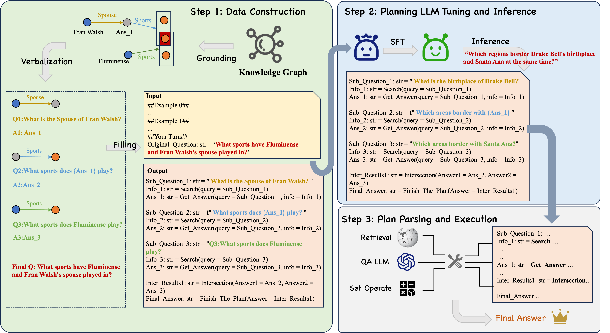

<h3 align="center"> Learning to Plan for Retrieval-Augmented Large Language Models from
Knowledge Graphs </h3>



## How to start
```
git clone https://github.com/zjukg/LPKG.git
```
### 1.Finetuning on KG-sourced planning data
The code of fine-tuning is constructed based on open-sourced repo [LLaMA-Factory](https://github.com/hiyouga/LLaMA-Factory).

1. Download our KG-sourced planning data from our [Huggingface repo](https://huggingface.co/datasets/WJJ-ZJU/CLQA_Wiki).
2. Put the downloaded `kg_supervise.json` file under `fine-tuning/data/` directory. 
3. Make sure you have downloaded the base model (Llama-3-8B-Instruct or CodeQwen1.5-7B-Chat). Fill in your base model directory `BASE_MODEL_DIR`, output directory `OUTPUT_DIR` in the `fine-tuning/run_exp_llama.sh`,`fine-tuning/run_exp_qwen.sh`. 

Finetune Llama3:
```
cd fine-tuning
sh run_exp_llama.sh
```

Finetune CodeQwen:
```
cd finetuning
sh run_exp_qwen.sh
```

### 2.Predict the Plan on Downstream QA Datasets
Before running script, fill in your checkpoint directory `CKPT_PATH`, base model directory `BASE_MODEL_DIR`, output directory `PRED_PATH`,  and the name of the dataset to be predicted `DATASET_NAME` in `fine-tuning/run_predict_llama.sh`, `fine-tuning/run_predict_qwen.sh`.

it should be note that the `output` in `*_planning.json` file is not the true output of planning LLM. They are just the final answers to questions.

Infer Llama3:
```
sh run_predict_llama.sh
```
Infer CodeQwen:
```
sh run_predict_qwen.sh
```

### 3.Parse Result
1. Download the wikipedia dump and put them into `/wikidump/`.
```
cd parser/wikidump
wget https://dl.fbaipublicfiles.com/dpr/wikipedia_split/psgs_w100.tsv.gz
wget https://dl.fbaipublicfiles.com/contriever/embeddings/contriever-msmarco/wikipedia_embeddings.tar
```
2. Download retriever model(Contriever-MSMARCO) and put it into `/contriever_ms/`
3. Fill in the planning result directory and output directory in `parse_result.py`
4. Fill in your OpenAI key in `gpt/call_gpt.py`
5. Run parser. Make sure you have enough GPU memory to load wikipedia embedding(we use 2*80G A100 in our experiments):
```
cd parser
python parse_result.py
```